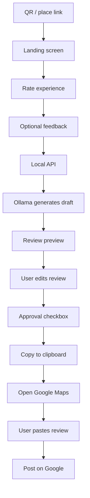

# ReviewBoost

A local, free, mobile-first AI review flow for businesses and residential communities. It captures resident/customer feedback, generates an AI draft locally, allows user editing and approval, and seamlessly redirects to the target Google Maps review page.

## System design workflow



## What this app does

- QR-style landing screen for the place being reviewed
- 1–5 star rating capture
- Optional free-text comment input
- Local AI-generated review draft using Ollama
- Review preview and user edit screen
- Required consent checkbox before continuing
- Copy-final-review-to-clipboard step
- Redirect to the actual Google Maps place review page
- Manual Google posting by the user

## Free / open-source stack

This project is designed to stay free and local:

- React + Vite: open-source and free
- Node.js + Express: open-source and free
- Ollama: open-source local AI runtime, free to run locally
- Google Maps / Google account: free to use, but requires the user’s Google account for posting

Important: no paid AI API, no cloud review service, and no paid SaaS dependency are required for the current version.

## Current implementation boundary

This app does not auto-post to Google from a normal browser app.

Google Maps does not allow a standard web app to reliably programmatically write into the review textarea and click Post. The app therefore follows a safe and transparent flow:

1. user rates and comments
2. AI drafts a review
3. user edits and approves it
4. review is copied to clipboard
5. user is redirected to the Google Maps review page
6. user clicks Write a review and posts manually

This is the correct behavior for a normal web app and avoids fake or unsafe automation.

## Tech stack

- Frontend: React + Vite
- Backend: Express server
- AI: Ollama with local model support
- Environment config: .env
- Project base: GitHub-ready repository structure

## Run locally

1. Install dependencies:

   npm install

2. Start Ollama locally and make sure a model is available, such as:

   ollama pull llama3.2

3. Start the app:

   npm run dev

This starts both the backend and frontend together.

## Quick start checklist

- [ ] Install Node.js
- [ ] Install dependencies with `npm install`
- [ ] Start Ollama
- [ ] Pull a model such as `llama3.2`
- [ ] Copy `.env.example` to `.env` and set your local values
- [ ] Run `npm run dev`
- [ ] Open the local frontend URL shown in the terminal
- [ ] Test the review flow end to end

## GitHub repository setup

```bash
git init
git add .
git commit -m "Initial review flow prototype"
git branch -M main
git remote add origin <your-repository-url>
git push -u origin main
```

## Environment variables

Create a .env file based on .env.example.

Key values:

- PORT=3001
- OLLAMA_BASE_URL=http://localhost:11434
- OLLAMA_MODEL=llama3.2
- RESTAURANT_NAME=Your Place Name
- VITE_RESTAURANT_NAME=Your Place Name
- VITE_GOOGLE_REVIEW_URL=https://maps.google.com/your-place-review-link
- VITE_GOOGLE_CLIENT_ID=

## Project structure

- src/ — React app UI
- server/ — Express API for AI review generation
- .env.example — environment template
- IMPLEMENTATION_PLAN.md — product and technical implementation plan
- package.json — scripts and dependencies

## GitHub-ready setup

The repository is structured with a GitHub-friendly layout and ignores generated/local files via .gitignore.

Standard GitHub flow:

- git init
- git add .
- git commit -m "Initial review flow prototype"
- git branch -M main
- git remote add origin <your-repo-url>
- git push -u origin main

## Future upgrades

Possible next steps after the current free prototype:

- add a browser extension for one-click paste into Google Maps review fields
- add Google OAuth only if a valid Google client ID is later provided
- add dashboard and analytics later, outside the current scope
- extend the workflow to restaurants, societies, or service businesses

## License

This project is provided as a local prototype and is not tied to any paid service or subscription.
