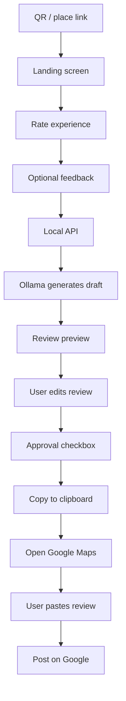

# ReviewBoost

A local, free, mobile-first AI review flow for businesses and residential communities. It captures resident/customer feedback, generates an AI draft locally, allows user editing and approval, and seamlessly redirects to the target Google Maps review page.

## System design workflow



## What this app does

- QR-style landing screen for the place being reviewed
- 1–5 star rating capture
- Optional free-text comment input
- Local AI-generated review draft using Ollama
- Review preview and user edit screen
- Required consent checkbox before continuing
- Copy-final-review-to-clipboard step
- Redirect to the actual Google Maps place review page
- Manual Google posting by the user

## Free / open-source stack

This project is designed to stay free and local:

- React + Vite: open-source and free
- Node.js + Express: open-source and free
- Ollama: open-source local AI runtime, free to run locally
- Google Maps / Google account: free to use, but requires the user’s Google account for posting

Important: no paid AI API, no cloud review service, and no paid SaaS dependency are required for the current version.

## Current implementation boundary

This app does not auto-post to Google from a normal browser app.

Google Maps does not allow a standard web app to reliably programmatically write into the review textarea and click Post. The app therefore follows a safe and transparent flow:

1. user rates and comments
2. AI drafts a review
3. user edits and approves it
4. review is copied to clipboard
5. user is redirected to the Google Maps review page
6. user clicks Write a review and posts manually

This is the correct behavior for a normal web app and avoids fake or unsafe automation.

## Tech stack

- Frontend: React + Vite
- Backend: Express server
- AI: Ollama with local model support
- Environment config: .env
- Project base: GitHub-ready repository structure

## Run locally on Windows

The included `launcher.bat` is the recommended Windows startup command. It:

1. Changes to the project directory.
2. Opens an Ollama window and runs `ollama run llama3.2`.
3. Waits three seconds.
4. Opens a second window, installs npm dependencies, and runs `npm run dev`.

Before the first launch:

- Install Node.js and make sure `npm` is available on `PATH`.
- Install Ollama and make sure the `llama3.2` model is available with `ollama pull llama3.2`.
- Copy `.env.example` to `.env` and adjust the local values if needed.

Double-click `launcher.bat` or run it from a Command Prompt. Keep both command windows open while using the app. The Vite frontend is normally available at `http://localhost:5173` and the API at `http://localhost:3001`.

The launcher runs `npm install` every time, so startup can take longer when dependencies need to be installed. To start the services manually instead, run:

```bash
npm install
npm run dev
```

The backend can still generate a local fallback review when Ollama is unavailable, but the Ollama window is required for model-generated drafts.

## Quick start checklist

- [ ] Install Node.js
- [ ] Install dependencies with `npm install`
- [ ] Install Ollama and pull `llama3.2`
- [ ] Copy `.env.example` to `.env` and set your local values
- [ ] Run `launcher.bat` on Windows, or use the manual commands above
- [ ] Open the local frontend URL shown in the terminal
- [ ] Test the review flow end to end

## Project structure

- src/ — React app UI
- server/ — Express API for AI review generation
- launcher.bat — Windows startup script for Ollama, the API, and Vite
- .env.example — environment template
- IMPLEMENTATION_PLAN.md — product and technical implementation plan
- package.json — scripts and dependencies

## License

This project is provided as a local prototype and is not tied to any paid service or subscription.
